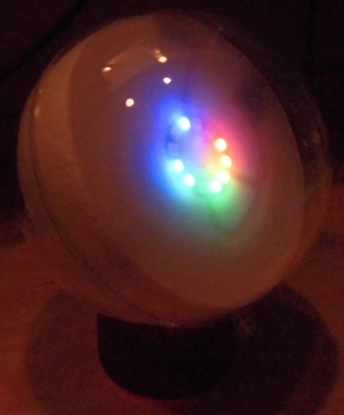
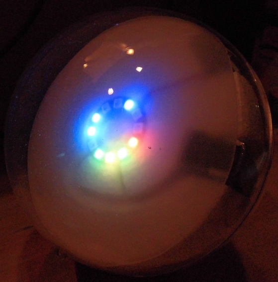
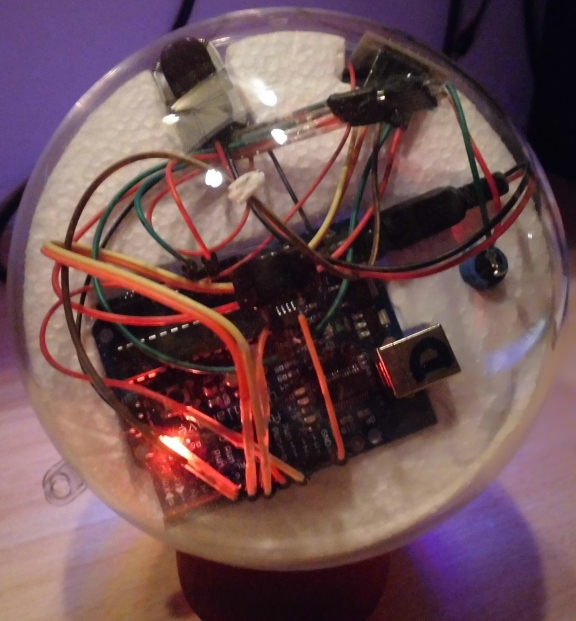
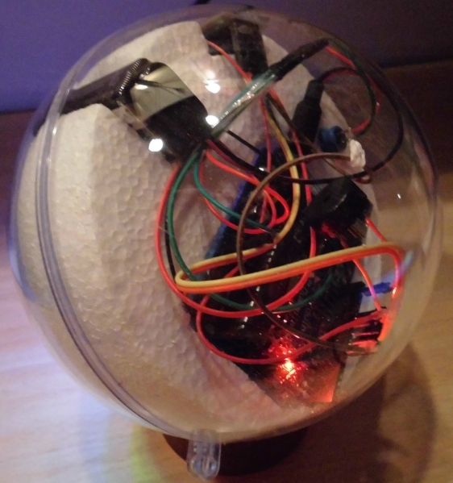
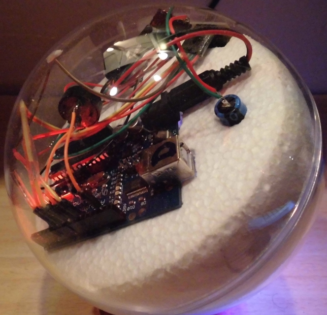
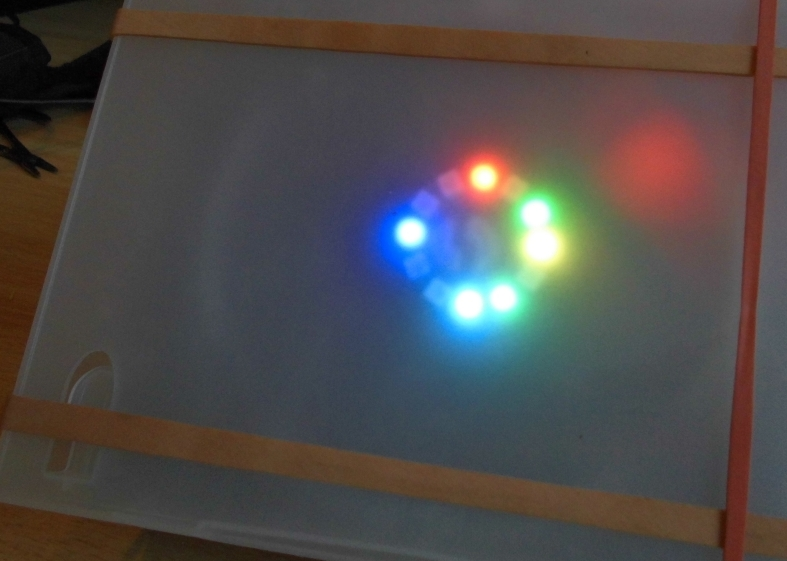
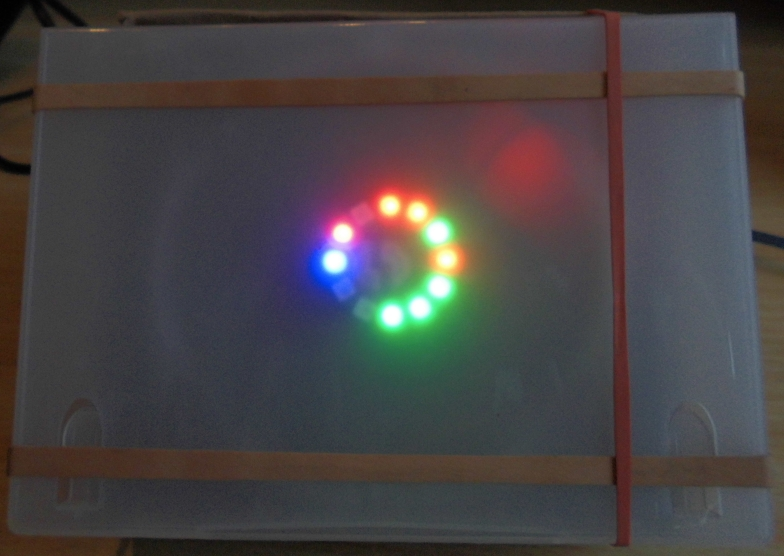

# PiClock

Arduino project for a clock that displays the time in binary beeps at pi o'clock PM

## How to read the time

Determine which LED goes on an off every second. This is LED with index 0. Then the LEDs are ordered clockwise. LEDs 4 and 8 change state every 1 in 5 seconds, to indicate their position.

| LED index |  0 | 1 | 2 | 3 | 4  | 5  | 6 | 7 | 8  | 9  | A | B | Color |
|-----------|----|---|---|---|----|----|---|---|----|----|---|---|------:|
| seconds   |  1 | 2 | 4 | 8 | 16 | 32 |   |   |    |    |   |   | Red   |
| minutes   |    |   |   |   | 1  | 2  | 4 | 8 | 16 | 32 |   |   | Green |
| hours     | 16 |   |   |   |    |    |   |   | 1  | 2  | 4 | 8 | Blue  |

Examples

| LED       |  R | R | R | R |    | G  | G | G | B  | B  | B | B | Blue  |

This equals: 3:14:15 (hh:mm:ss)

| LED index |  0 | 1 | 2 | 3 | 4  | 5  | 6 | 7 | 8  | 9  | A | B | Color |
|-----------|----|---|---|---|----|----|---|---|----|----|---|---|------:|
| LED       |  R | R | R | R |    | G  | G | G | B  | B  | B | B | Blue  |
| seconds   |  1 | 2 | 4 | 8 | 16 | 32 |   |   |    |    |   |   | Red   |
| minutes   |    |   |   |   | 1  | 2  | 4 | 8 | 16 | 32 |   |   | Green |
| hours     | 16 |   |   |   |    |    |   |   | 1  | 2  | 4 | 8 | Blue  |

## Backside

## Prototype

